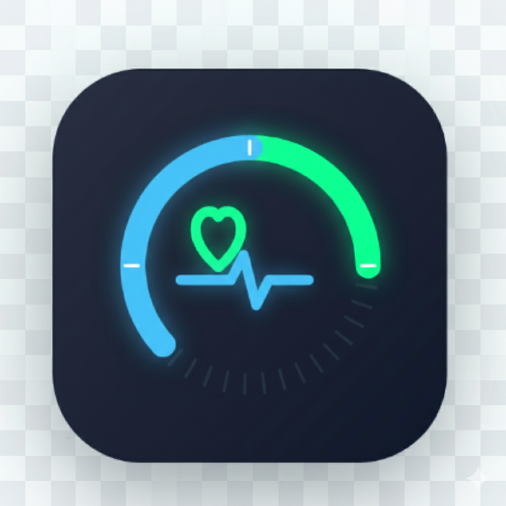
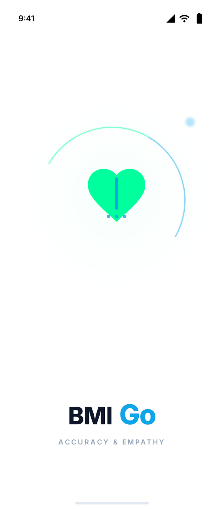

<div align="center">
  

  <h3 align="center">BMI Go</h3>

  <p align="center">
    A modern, user-friendly mobile application for tracking your Body Mass Index (BMI) and health metrics.
    <br />
    <a href="https://github.com/Dhavalkurkutiya/bmigo/issues">Report Bug</a>
    ·
    <a href="https://github.com/Dhavalkurkutiya/bmigo/issues">Request Feature</a>
  </p>
</div>

<!-- BADGES -->
<div align="center">

[](https://opensource.org/licenses/MIT)
[](https://reactnative.dev/)
[](https://expo.dev/)
[](https://www.typescriptlang.org/)
[](http://makeapullrequest.com)

<br />

[](https://expo.dev/artifacts/eas/6b9FBB9rYCHoT2JGdxCivz.apk)

</div>

<br />

## 📋 About The Project

BMI Go is designed to be your go-to health companion. Built with **React Native** and **Expo**, it offers a seamless cross-platform experience (iOS & Android) to calculate BMI, track progress, and get personalized health insights. Whether you're an athlete or just starting your fitness journey, BMI Go adapts to your needs.

### 📸 Screenshots

<div align="center">
  
  <!-- Add more screenshots here as you develop -->
</div>

## ✨ Key Features

- 🧮 **Advanced Calculation**: Accurate BMI calculation supporting **Standard** and **Indian (ICMR 2020)** classification modes.
- 🏋️ **Athlete Mode**: Smart adjustments for individuals with higher muscle mass to provide realistic health insights.
- 🥗 **Nutrition Engine**: Personalized goals for Calories, Protein, and Macros using the **Mifflin-St Jeor Equation**.
- 📊 **Dynamic Results**: Interactive **Clinical Scale** visualization with color-coded health markers.
- 🎨 **Modern UI**: Sleek, glassmorphism-inspired interface with full **Dark/Light mode** support and smooth animations.
- 📱 **Responsive**: Optimized for all screen sizes with haptic feedback for a premium feel.

## 🛠 Built With

This project is built using modern mobile development technologies:

- **[React Native](https://reactnative.dev/)** - The core framework for building native apps using React.
- **[Expo](https://expo.dev/)** - The platform and tools for developing universal React applications.
- **[Expo Router](https://docs.expo.dev/router/introduction/)** - File-based routing for React Native.
- **[TypeScript](https://www.typescriptlang.org/)** - For type-safe code and better developer experience.
- **[React Native Reanimated](https://docs.swmansion.com/react-native-reanimated/)** - For smooth, 60fps animations.
- **[Async Storage](https://react-native-async-storage.github.io/async-storage/)** - For local data persistence.

## 🚀 Getting Started

Follow these instructions to get a local copy of the project up and running.

### Prerequisites

- Node.js (LTS version recommended)
- npm or yarn
- Expo Go app on your physical device (iOS/Android) or an Emulator.

### Installation

1.  **Clone the repository**

    ```bash
    git clone https://github.com/Dhavalkurkutiya/bmigo.git
    cd bmigo-frontend
    ```

2.  **Install dependencies**

    ```bash
    npm install
    ```

3.  **Start the development server**

    ```bash
    npx expo start
    ```

4.  **Run on device/emulator**
    - Scan the QR code with the **Expo Go** app (Android) or Camera app (iOS).
    - Press `a` to run on Android Emulator.
    - Press `i` to run on iOS Simulator.
    - Press `w` to run in the web browser.

## 🤝 Contributing

Contributions are what make the open-source community such an amazing place to learn, inspire, and create. Any contributions you make are **greatly appreciated**.

1.  **Fork the Project**
2.  **Create your Feature Branch** (`git checkout -b feature/AmazingFeature`)
3.  **Commit your Changes** (`git commit -m 'Add some AmazingFeature'`)
4.  **Push to the Branch** (`git push origin feature/AmazingFeature`)
5.  **Open a Pull Request**

## 📄 License

Distributed under the MIT License. See `LICENSE` for more information.

## 👤 Author

**Dhaval Kurkutiya**

- Github: [@Dhavalkurkutiya](https://github.com/Dhavalkurkutiya)

<p align="right">(<a href="#top">back to top</a>)</p>
